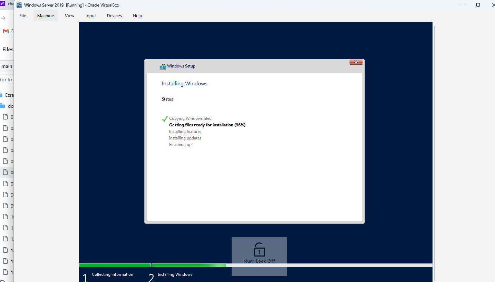
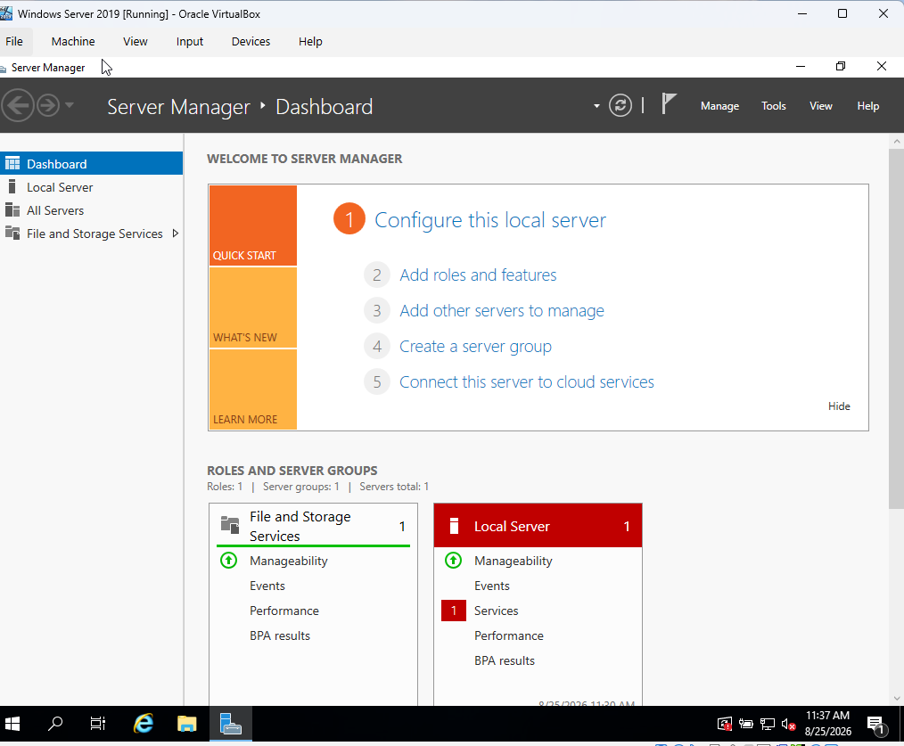
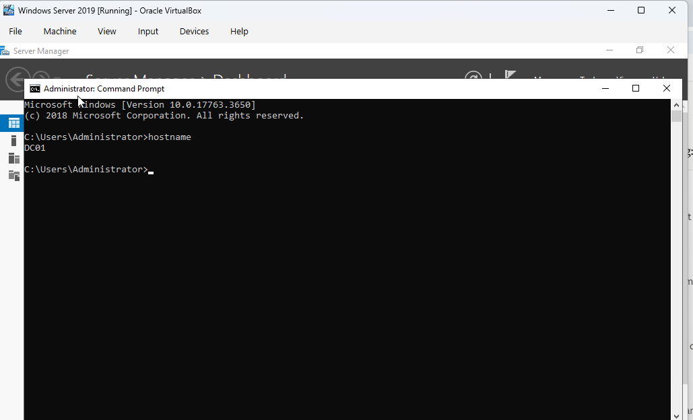
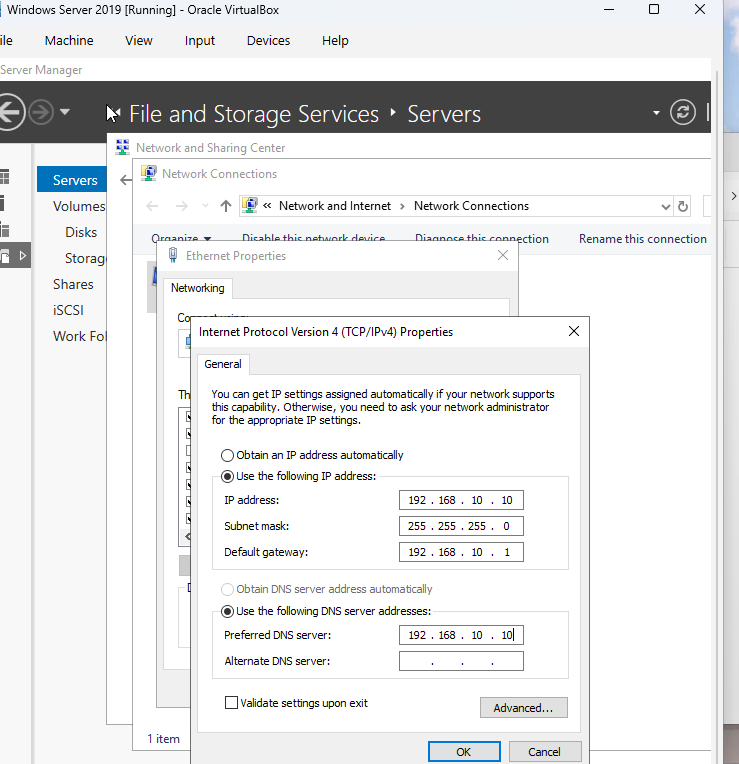

# Active directory Deployement

## Objective

The objective of this document is to deploy Active Directory Domain Services (AD DS) to provide centralized authentication, and management for EzraTech enterprise environment.

At the completion of this deployment, users and computers will be managed through a single windows domain.

# Background

Managing comptuters individually becomes difficult as organization grows. Active Directory allows administrators to centrally manage:

- User accounts
- Computers
- Password policies
- Security groups
- OUs
- Authentication
- Group policy
 
 This reduces administrative overhead while improving security and consistency across the organization.

 # Server information

 Setting   | value
 Hostname    DC01
 OS        | windows server 2019
 Domain name| corp.ezratech.local
 IP address | 192.168.10.10
 Default gateway | 192.168.10.1
 DNS        | 192.168.10.10

 # Section 1 - Installing Windows Server

 # 1. Install Windows Server 2019

 A new windows server 2019 VM was created in Oracle VirtulBox.

 The server will become the primary Domain Controller for the EzraTech environment.

 ## Tasks
- create Virtual Machine
- Allocate CPU
- Allocate Memory
- Attach Windows Server ISO
- Install Windows Server

# Validation

The server successful boots to windows desktop

# Screenshot - windows serverinstall 

# Section 2 - Rename the server

# 2. Rename the server

By default, windows assigns a random computer name.

The server was renamed to: DC01

This naming convention clearly identifies the server as the first Domain Controller.

## Why?

Meaningful hostnames simplify:

- Administration
- Documentation 
- Troubleshooting

## Screenshot - system properties showing hostname DC01 or simply run the command "hostname" in command prompt.

## Validation
The server restarts successfuly with the new hostname

## Screenshot - rename server.png

# Section 3 - Configure Static  IP

Infrastrucure servers should never use DHCP.

A static IP address ensures that clients can always locate the domain controller.

Configuration

IP address -  192.168.10.10
Subnet Mask - 255.255.255.0
Gateway - 192.168.10.1
DNS - 192.168.10.10

# Screenshot - IPV properties

## Validation 
ipconfig /all confirms the configuration

# Section 4  - Install AD DS

# 4. Install Active Directory Domain Services

The active directory domain services role was installed using server manager.

## Installed Role

Active Directory Domain Services

## Why?

This roles enables the server to become the Domain Controller capable of authetication users and computers.

# Screenshot  - AD roles Features wizard, install-adds role

## Validation

The AD DS role appears unders the installed packages.

# Section 5 - Promote ro Domain Controller.

# 5. Promote the Server to a Domain Controller

After installing the AD DS role, the server was promoted to a Domain Controller.

New Forest
corp.ezratech.local
Forest Functional level
Windows Server 2019
Domain Functional level
Windows Server 2019
DNS - Installed
Global catalog - enabled

## Screenshot Deployment configuration wizard, promote server.png, domain-created.png

## Validation

The server restarts successfully and the domain created.

# Section 6 - Verify Active Directory 

# 6. Verify Active Directory administration tools became available.
After rebooting, Active Directory administrative became available.

The following tools were verified:

- Active Directory Users and Computers
- DNS manager
- Server Manager

## screenshot - Server manager dashboard

# Section 7 - Create the Organizational Unit (OU) strucure

Organizatinal units are used to logically organize users, computers, and other Active Directory objects.

A well desgined OU strucure simplifies administration, enables group policy deployment, and allows delegation of administrative tasks.

## OU design

The following OUs were created for the EzraTech Environment.

EzraTech
 - Users
 - Computers
 - Servers
 - Groups
 - IT
 - HR
 - Finance
 - Sales

 ## Screenshot - Active Directory Users and computers displaying EzraTech OU strucure

 # Section 8 - Create Security Groups

 Security groups simplify management by assigning permissions to groups rather than individual users.

 This approach follows microsoft's recommendation best practices and makes administration more efficient.

 ## Security groups created
 - IT admins
 - HR_Users
 - Finance-Users
 - Sales-Users
 - Domain_Admins (Built-in)

 # Why security groups

 Instead of assigning permissions to individual Users e.g Ezra - shared folder, John - shared folder permissions are assigned once to a specific group. For example, Finance_Users - Finance Folder. All Finance employees inherit the required permissions through the group membership.

 # Screenshots of security groups created in AD

 # Section 9 - Create User Accounts

 User accounts allow employees to authenticate to the Active directory domain and access company resources.

 ## Sample Users

 Name     |      Department
 Ezra Kipgetich    IT
 John Smith       HR
 Michael Brown   Finance
 David Wilson     Sales

 ## Acount standards

 The following standards are used:
 - Unique username
 - Strong password
 - Password change at first login
 - Department assignment

 # screenshots of user accounts displayed in AD

 # Section 10 - Join the Windows 11 client

 The Windows 11 workstation was joined to the EzraTech Active Directory domain.

 Joining a computer to the domain allows centralized authentication and policy management.

 ## Computer information

 Hostname - PC01
 Domain - corp.ezratech.local

 ## Join Process

 The windows 11 client was configured to use the Domain Controller as it's DNS Server.

The computer was then joined to Active Directory Domain.

After joining the domain, the computer was restarted.

## system properties showing the computer was joined to the domain

## Validation

The Windows 11 workstation successfuly joined the AD and Domain users can now authenticate using their domain credentials.

# Section 11 - Verify the Domain login

Verify that the users can successfuly authenticate using their AD accounts.

# Test

The Windows 11 client was restarted.
A domain user account was used to sign in,
Authentication was successfuly completed through the Domain Controller.

## Verification

The following items were confirmed.

- User profile created
- Domain authentication successful
- DNS functioning correctly
- Group policy processing initiated

## screenshot - windows 11 login screen showing successful domain login

